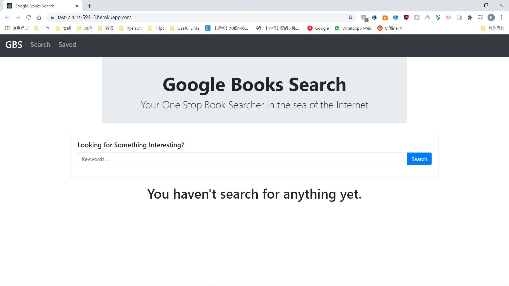
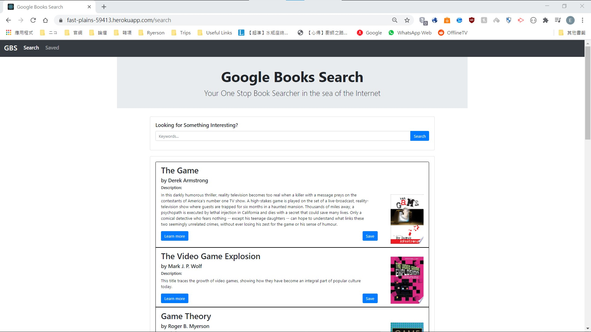
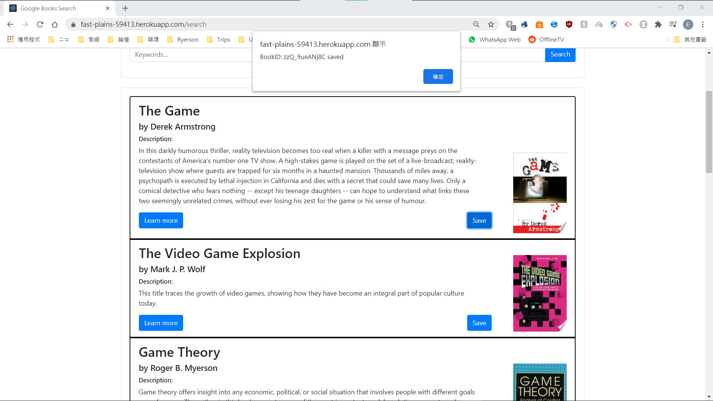
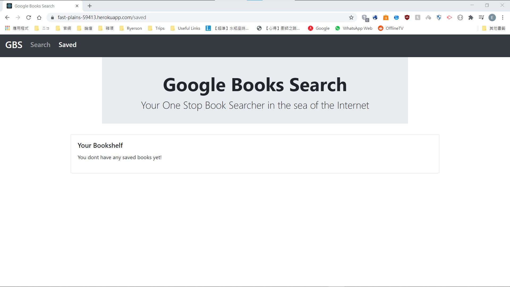
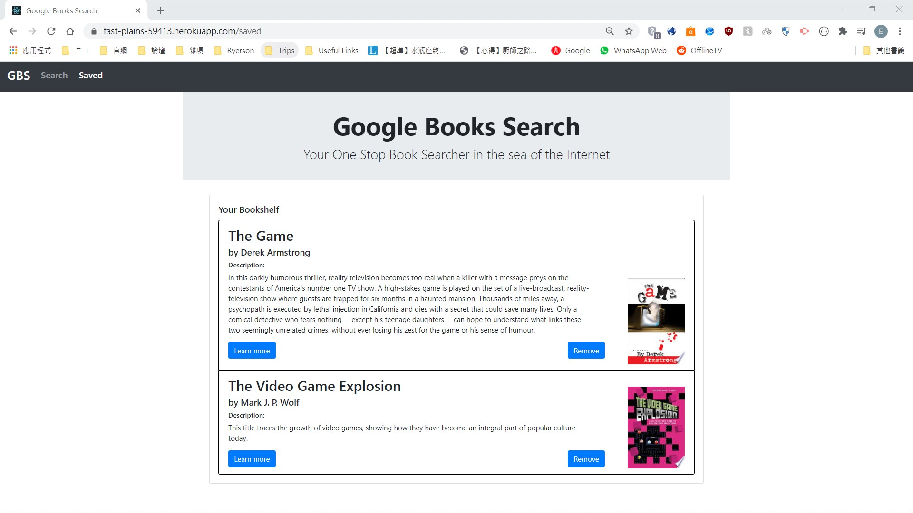
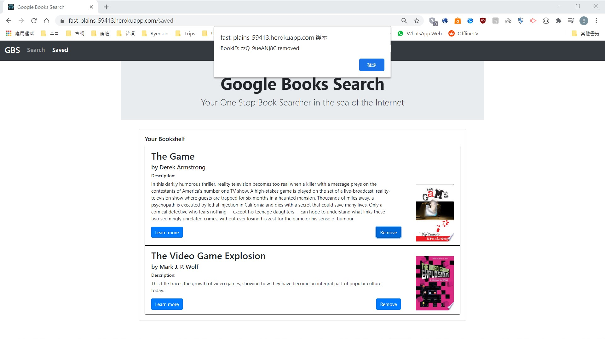

# Google-Books-Search
## Goal
To make an app that search for books with Google Books API and save selected book

## About the App
- It is currently hosted on Heroku with the use of MongoDB Atlas: https://fast-plains-59413.herokuapp.com/
- This app is built using the **MERN** stack, which is **MongoDB**, **ExpressJS**, **ReactJS** and **NodeJS**, along with **Google Books API** and **Bootstrap**.

## What can it do?
- Able to search books and display the results from Google Books API in the *Search* page
- Able to save selected books to the database and retrieve them in the *Saved* page
- Able to remove selected books from the database in the *Saved* page
- Able to make calls from the Front-end (**ReactJS**) to the Back-end (**ExpressJS**)

## Mission Critial Files
- Server side:
    - *server.js*: for setting up the server, establish connection to the database, serving static assets from the React server and hosting all the endpoints
    - *package.json*: contains basic info about the server such as command line instructions and packages used
    - *routes* folder: contains all API endpoints
    - *index.js* in *routes* folder: add prefix to api endpoints when hosted by *server.js*
    - *models* folder: contains files for creating schema on MongoDB
    - *models/book.js*: contains specific data structure for creating schema for a book
    - *controllers/booksController.js*: an orm for manipulating the database, e.g. inserting a new entry, updating an entry, etc
- Client side(*src* folder):
    - *components* folder: contains files of different React components with logic, which will either be called from another component or *pages* files
    - *pages* folder: contains master React components representing different pages of the app, which will be called from *App.js*
    - *utils/API.js*: contains all API calls to the server as functions, which will be used by different React components in the *components* folder
    - *App.js*: used as a router, which will call different master React component from *pages* folder depending on the path/URL
    - *index.js*: used to insert the contents generated by *App.js* to *index.html* in the *public* folder
    - *public* folder: auto-generated files by React
    - package.json: contains basic info about the client-side server such as command line instructions and packages used

## Search Page
- To search, enter keywords in the *search bar* and press the *Search* button
- To save books, press the *save* button and an *alert* message with the book's ID will pop up
- To learn more about a certain book, press the *Learn more* button and it will open a new tab to Google Books

## Saved Page
- To remove books, press the *remove* button and an *alert* message with the book's ID will pop up

